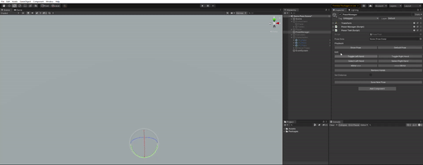

# Unity XR Hand Poser Tool

## Description
This tool simplifies creating animated hand poses for use in XR applications. The core scripts are not coupled to any specific XR framework so it remains flexible and lightweight. Included with this package is a demo scene built with the [Unity XR Interaction Toolkit](https://docs.unity3d.com/Packages/com.unity.xr.interaction.toolkit@2.0/manual/index.html) package.

## Features

## Installation

1. Install package from git URL via Package Manager

    

2. Use `https://github.com/ctedrick/com.tedrickdev.handposer.git` to pull package.

    

3. Package will install and pull package dependencies.

## Dependencies
The following packages are installed automatically when pulling this via Package Manager

* `Unity XR Interaction Toolkit v2.0.0+`
* `Unity Input System v1.2.0`

## Usage

Refer to the **Demo Pose Scene** for instructions of how to use the tool.