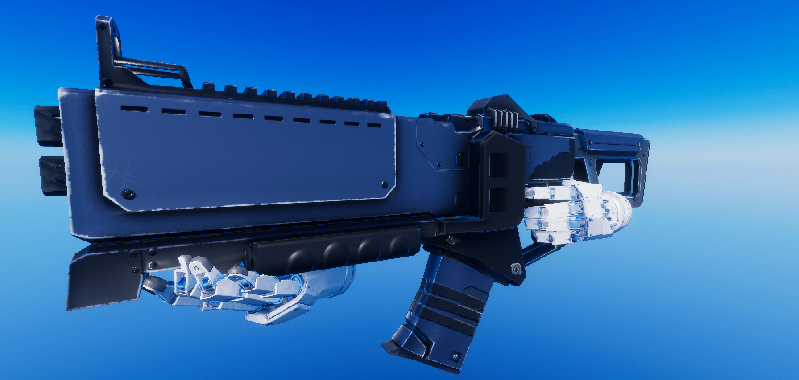
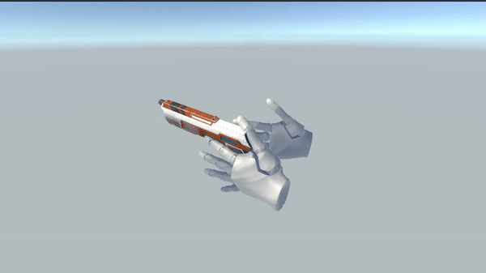
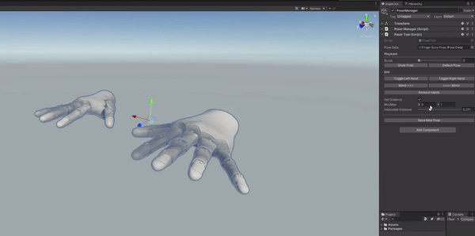
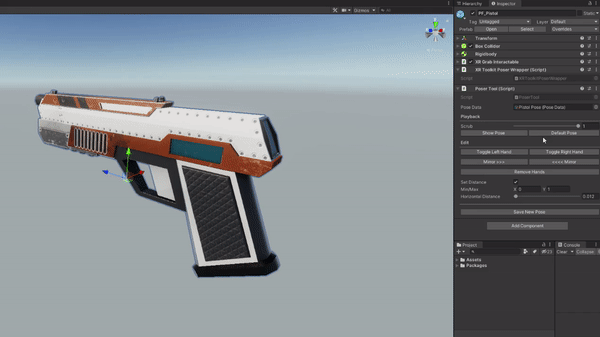
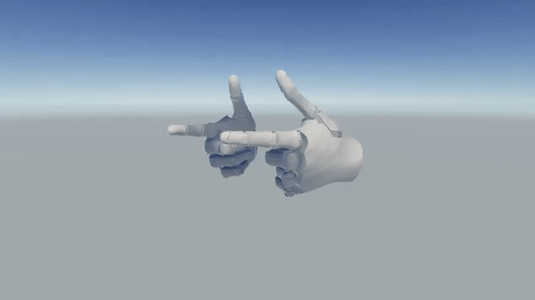
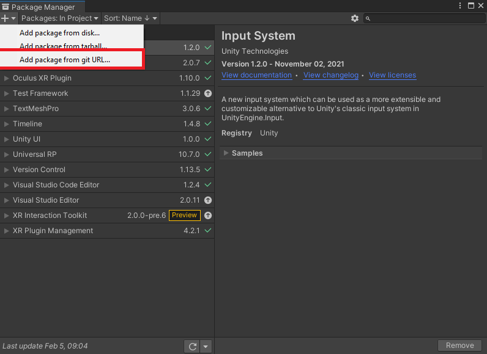
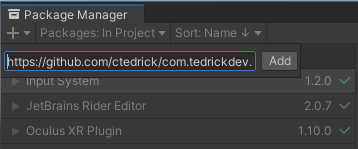

# Unity XR Interactions Toolkit

## Description
This is a lightweight hand poser tool that simplifies creating animated hand poses for use in Unity XR applications.
Built using vanilla Unity colliders to handle interactions, no other framework is needed to use this package.

Grab interactions are included as well supporting both one and two-handed interactions. 
The framework is extendable, making it easy to add other types of interactions as needed.

## Features

### Two Hand Interactions

### One Hand Interactions

### Pose Editor Tool

## Installation

1. Install package from git URL via Package Manager

    

2. Use `https://github.com/ctedrick/com.tedrickdev.handposer.git` to pull package.

    

3. Package will pull package dependencies.

## Dependencies
The following are installed automatically when pulling this via Package Manager

* `Unity Input System v1.2.0`

## Usage

TBD
